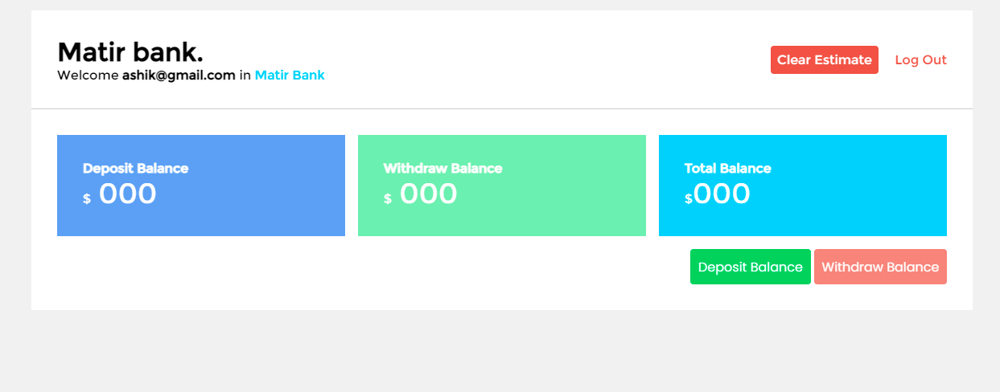

# Simple Banking Estimate in Vanilla JavaScript.

This is simple vanilla javascript and local storage application. In this project I will implement all of feature in login/logout system and also has local storage benefits. If you want to contribute this project please feel free to do that and make it more attractive as like of professional. Thanks

## Available features
- Login/Logout System as like Real
- Showing Username in Dashboard
- Simple Banking Calculation 
- Delete all Estimate Option
- Real time working
- All data comes from Browser LocalStorage.

## Using Technologies
 - HTML5/HTML
 - CSS3/CSS
 - Vanilla JavaScript
 - Browser LocalStorage
 - Google Fonts (Montserrat)
 - VS Code Editor
 - Git bash/ Github
 - Favicon from Icons8
 - Project Idea From Programming Hero

 and many more

 ## If you want to see the live link of this project please check in about

# Demo Screenshot about my projects

> Thank for reach out me on Github Account.